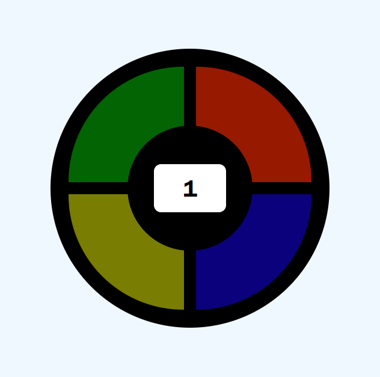
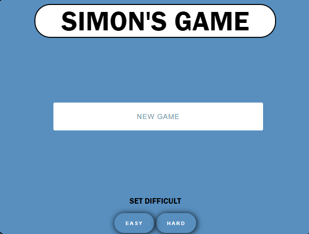
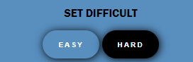
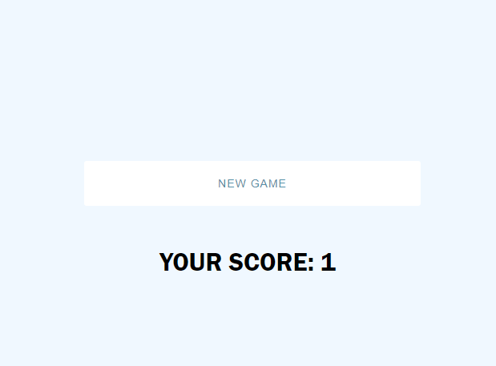

# SIMON GAME
## Documentation
#### This game is base on one the game of SIMON GAME

### How the game works

* The board will be displaying a pattern of colors.
* You will have to press the correct pattern of colors showed.
* You have to game modes, the difficult one it will be faster showing the colors.

If you want to play you can make it here.
[Simon Game](https://grpnzi.github.io/Simon-Game/)

## Development

### Phase 1: HTML and CSS structure

The first phase consisted of looking at possible structures to present the page and how to make the layout simple.

The idea of the game is very simple at a visual level, a simple central box with the 4 colors to represent. With the number of rounds in the center.



There are no complications in this section.

### Phase 2: Showing the patern

Display the color pattern by making the effect of turning on the color. Using an asynchronous function makes it much easier to read the code and understand how the function works.

```javascript
async pathDecide () {
    this.countValue.innerText = this.round;

    for (let i of this.randomColors) {
        let currentColor = document.querySelector(`#${i}`);
        await this.wait(this.difficult);

        // Play the sound associated with the color before changing the background color
        this.sounds.play(this.sounds[i]);

        // change the color background waiting x time to execute 
        currentColor.style.backgroundColor = `${this.colors[i]["new"]}`;
        await this.wait(this.difficult);
        currentColor.style.backgroundColor = `${this.colors[i]["current"]}`;
        await this.wait(this.difficult);
    }
    
    this.generatingSequence = false;
};
```

#### Challenges:

 * Use an asynchronous function and set the correct timing to achieve a good " glowing " effect. 

### Phase 3: User interaction

This phase consists of implementing the system to detect when the user copies the color sequence that has just been reproduced.

```javascript
// board.js
clickScanner() {
    // check if the pattern is beeing showed to the player
    if (this.generatingSequence) return false;
    // check if the player has clicked something
    if (!this.clickSequence.length) return false;

    if (this.generatingSequence || this.clickCount >= this.clickSequence.length) return false;

    // If the color pressed match with the color it has to be
    if (this.clickSequence[this.clickCount].id == this.randomColors[this.clickCount]) {

        //Color blick effect on click
            
        this.clickSequence[this.clickCount].style.backgroundColor = `${this.colors[this.randomColors[this.clickCount]]["new"]}`;

            // Using setTimeout for the delay
            setTimeout(() => {
                // Check if click sequence is not returning undefined
                if (this.clickSequence[this.clickCount]) {
                    // Play the sound associated with the color
                    let sound = this.clickSequence[this.clickCount].id;
                    this.sounds.play(this.sounds[sound]);

                    this.clickSequence[this.clickCount].style.backgroundColor = `${this.colors[this.randomColors[this.clickCount]]["current"]}`;

                        //User click
                        this.clickCount += 1;
                            
                        //Next level if number of valid clicks == round
                        if (this.clickCount == this.round) {
                            this.clickCount = 0;
                            this.clickSequence = []
        
                        // Using setTimeout for the delay before starting the next round
                        setTimeout(() => {
                            this.sequenceGenerator();
                            this.sounds.play(this.sounds.success);
                        }, 1000);
                    }
                }
            }, 200);
    // ends the game
    } else {
        this.gameIsOver = true;
        this.sounds.play(this.sounds.gameOver);
    }
}

// script.js
// detect if you are clicking the colors
function handleMouseInput(click) {
    // check if is the sequence is running to not catch any click
    if (game.board.generatingSequence) return;
    game.board.clickSequence.push(click.target);

}
```
#### Challenges:

 * Do without an asynchronous function and add conditions to avoid errors.
 * Avoid the posibilty of register the pattern when is beeing displayed.

 ### Phase 4: Setting the difficult

 In this part, I wanted to add the possibility of being able to choose between two difficulty modes, one 
 easy and one more difficult. So that players can pick the option that best suits their needs.

  

 When the player select a difficult level the button will be displayed with a black background.

 

I have added this functionality by setting the time value that the color is displayed during the sequence. 
To do this I created an object that contained the values depending on the difficulty, then 
when the user selected the difficulty this value would be modified in the board.js setting the new time. 
In case the user does not select a difficulty, the default difficulty will be set to easy.

```javascript
// script.js
const difficult = {easy: 500, hard: 150};
const easyButton = document.getElementById("easy-button");
const hardButton = document.getElementById("hard-button");

//...
// set the difficult level to easy
easyButton.addEventListener("click", function () {
    console.log("easy mode");
    updateButtonClasses()
    modeSet = difficult.easy;
});

// set the difficult level to hard
hardButton.addEventListener("click", function () {
    console.log("hard mode");
    updateButtonClasses()
    modeSet = difficult.hard;
});
//...
// starts the game
function startGame() {
    if (!modeSet) modeSet = difficult.easy;
    
    game = new Game(modeSet);

    game.start();
    resetInactivityTimer();
}
```
#### Challenges:

 * There are no complications in this section.

### Phase 5: Extra features

In this phase I wanted to add sounds, to make it easier to memorize the patterns, also to 
indicate when you make the pattern in the correct way.

```javascript
// sounds.js
class Sounds {
    constructor(){
        this.color1 = new Audio("./audio/color1.mp3")
        this.color2 = new Audio("./audio/color2.mp3")
        this.color3 = new Audio("./audio/color3.mp3")
        this.color4 = new Audio("./audio/color4.mp3")
        this.success = new Audio("./audio/success.mp3")
        this.gameOver = new Audio("./audio/game-over-arcade.mp3")
    }

    play(sound){
        sound.play()
    }
}

// board.js
//...
// ends the game
} else {
    this.gameIsOver = true;
    this.sounds.play(this.sounds.gameOver);
}
```
In addition, I have also added a screen that is displayed when the game is lost, as well as a button to start the game again.



```javascript
end() {
    console.log("end game");
    const score = document.getElementById("score");
    // Hide the game screen
    this.gameScreen.style.display = "none";
    // Display the starter screen
    this.endScreen.style.display = "block";
    // Show the score
    score.innerHTML = `YOUR SCORE: ${this.board.round}`
}
```